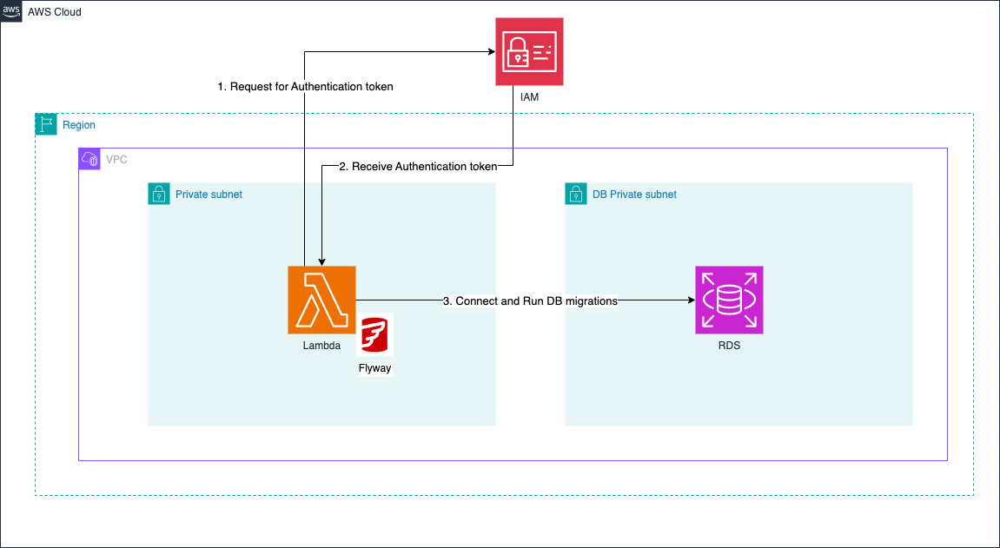

# flyway-lambda
Code for AWS Lambda to execute database creation/migrations on relational DB

Find more details in [my guide](https://dev.to/aws-builders/run-flyway-db-migrations-with-aws-lambda-and-rds-part-1-2a6j)

### Architecture


---

## Project Structure

`/docker` Docker Compose Setup for Local Development

`/src/main/resources/db/migration` directory containing SQL migration scripts

`/src/main/java/com/example/DatabaseMigrationHandler.java` Java class DatabaseMigrationHandler that is designed to run Flyway migrations against DB

## Usage Local testing
1. Start the Database
```
cd docker
docker-compose up -d
```
2. Clean
Deletes the build directory, effectively cleaning the project. This is useful for ensuring a fresh build environment.
```
./gradlew clean
```

3. Build
Compiles the source code, runs tests, and packages the project into a JAR file. This command performs all the necessary steps to create a build artifact.
```
./gradlew build
```

4. Run
Executes the main class specified in the application section. In this case, it will run com.example.DatabaseMigrationHandler, which handles the Flyway migrations.
```
./gradlew run
```

## License

This project is licensed under the MIT License. See the `LICENSE` file for more information.